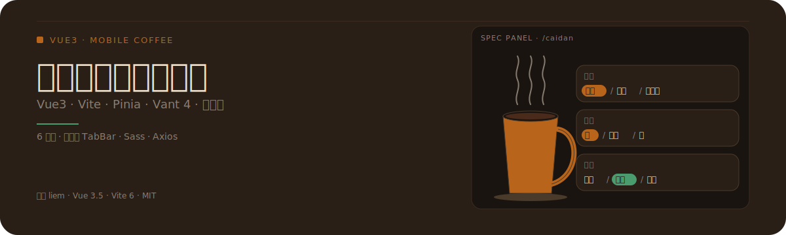
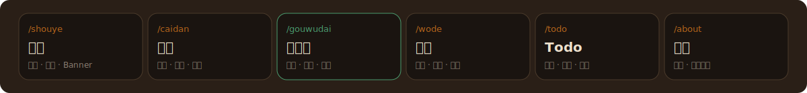

<p align="center">
  
</p>

# 瑞鑫咖啡店管理系统

一个基于 Vue3 的移动端咖啡点单应用:顾客浏览菜单、选择规格(杯型 / 温度 / 甜度)、加入购物袋并提交订单,另附 Todo 待办与个人中心。

---

## 价值证明

右侧 hero 中的咖啡杯与三张规格选择卡,正是 `/caidan` 菜单页的核心交互原型。下方两张表是真实落地的视图路由与 TabBar 配置,不是文案想象。

### 功能模块 · 6 视图路由



| 视图 | 路由 | 文件 | 说明 |
| --- | --- | --- | --- |
| 首页 | `/shouye` | `src/views/ShouyeView.vue` | 商品推荐、热门展示、活动 Banner |
| 菜单 | `/caidan` | `src/views/CaidanView.vue` | 分类浏览、商品详情、规格选择、加入购物车 |
| 购物袋 | `/gouwudai` | `src/views/GouwudaiView.vue` | 数量调整、金额计算、订单提交 |
| 我的 | `/wode` | `src/views/WodeView.vue` | 用户信息、历史订单、系统设置 |
| Todo | `/todo` | `src/views/TodoView.vue` | 任务增删、状态切换、分类管理 |
| 关于 | `/about` | `src/views/AboutView.vue` | 项目介绍、版本信息 |

### 自定义 TabBar

项目用 `src/components/MyTabBar.vue` 替代 Vant 原生 `tabbar`,自绘图标与高亮态,只暴露 4 个一级入口:

| Tab | 图标 | 路由 |
| --- | --- | --- |
| 首页 | `home` | `/shouye` |
| 菜单 | `menu` | `/caidan` |
| 购物袋 | `shopbag` | `/gouwudai` |
| 我的 | `my` | `/wode` |

---

## 它是什么

一套面向咖啡馆点单场景的移动端 Web 应用,基于 Vue3 单页架构,覆盖「浏览 → 选规格 → 加购物袋 → 下单」的完整顾客动线,并附带 Todo 与个人中心作为辅助模块。

---

## 为什么不同

- **移动端优先**:所有视图按移动端尺寸与触控交互设计,而非桌面端响应式收缩。
- **Vant 4 组件库**:用 Vant 4 的现成移动端组件(商品卡、规格弹层、步进器等)搭建,而不是用桌面 UI 库硬改。
- **自定义 TabBar**:`MyTabBar.vue` 取代 Vant 原生 `tabbar`,图标与切换态完全自控,Todo 与关于通过非 TabBar 入口进入。
- **规格选择交互**:杯型 / 温度 / 甜度三组规格作为独立可选卡片呈现,选中态高亮(主色咖啡棕 / 松绿强调),是菜单页的视觉签名。

---

## 如何运作

### 分层架构

```
src/
├── api/                    # 接口层
│   ├── axios.js            # axios 实例
│   ├── config.js           # 接口地址配置
│   └── request.js          # 请求封装
├── assets/                 # 静态资源
├── components/
│   ├── MyTabBar.vue        # 自定义底部导航
│   └── icons/              # 自绘图标
├── router/
│   └── index.js            # Vue Router 4 路由表(6 视图)
├── stores/
│   └── counter.js          # Pinia 状态
├── views/                  # 视图层(6 个)
│   ├── ShouyeView.vue
│   ├── CaidanView.vue
│   ├── GouwudaiView.vue
│   ├── WodeView.vue
│   ├── TodoView.vue
│   └── AboutView.vue
├── App.vue
└── main.js
```

- **views**:6 个视图组件,每个对应一条路由。
- **router**:`Vue Router 4` 集中注册 6 条路由,TabBar 4 条 + 非 TabBar 2 条。
- **stores**:Pinia 管理购物袋、用户态等跨视图状态。
- **components**:仅放可复用 UI(`MyTabBar` + `icons`),视图不外提。
- **api**:axios 实例 + 配置 + 请求封装三层分离,便于切接口环境。

### 点单流程

```
首页 /shouye  ──浏览推荐──▶  菜单 /caidan
                              │
                              │ 选规格(杯型/温度/甜度)
                              │ 加入购物车
                              ▼
                          购物袋 /gouwudai
                              │
                              │ 调数量 · 算金额
                              │ 提交订单
                              ▼
                          我的 /wode  (历史订单)
```

---

## 如何使用

### 环境要求

- Node.js `>= 16`

### 安装与启动

```bash
# 安装依赖
npm install

# 启动开发服务器(默认 http://localhost:5173)
npm run dev

# 生产构建
npm run build

# 代码检查
npm run lint
```

开发服务器默认监听 `5173` 端口(Vite 默认)。

---

## 技术栈

| 类别 | 选型 |
| --- | --- |
| 框架 | Vue 3.5 |
| 构建 | Vite 6 |
| 状态 | Pinia |
| 路由 | Vue Router 4 |
| UI 库 | Vant 4 |
| HTTP | Axios |
| 样式 | Sass |
| 代码风格 | Prettier (`.prettierrc`) |

---

## 项目结构

```
ruixin-coffee-shop/
├── src/                # 源码(见「如何运作」分层架构)
├── index.html
├── vite.config.js
├── package.json
├── .prettierrc
└── .gitignore
```

---

## License

MIT © liem
